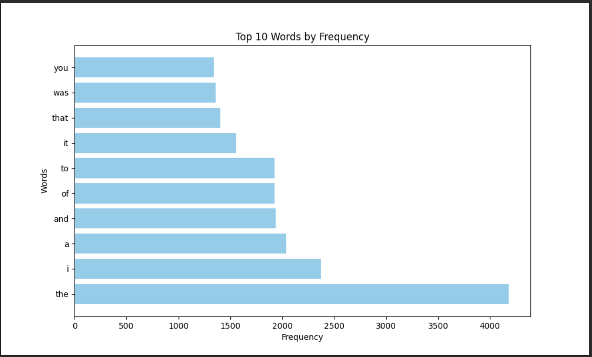

# goit-algo2-hw-06

Design and Analysis of Algorithms

Master of degree from University

## Homework 6
### for the analisys was taken the book 
### The Casebook of Sherlock Holmes 
by Arthur Conan Doyle

[Link to the Book](https://gutenberg.net.au/ebooks01/0100291.txt)

### Results of the analisys:

